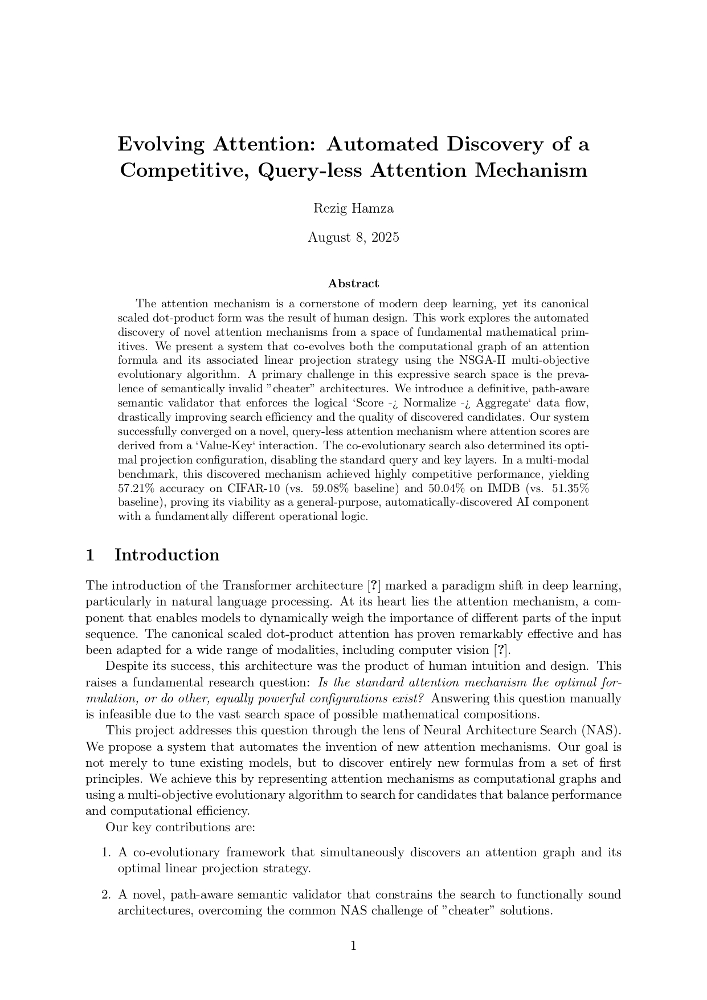

# Evolving Attention: Automated Discovery of Novel Attention Mechanisms



## Table of Contents
1.  [Project Overview](#1-project-overview)
2.  [Directory Structure](#2-directory-structure)
3.  [Core Components](#3-core-components)
4.  [Main Scripts](#4-main-scripts)
5.  [Running The Project](#5-running-the-project)
    *   [Stage 1: Search for Candidates](#stage-1-search-for-candidates)
    *   [Stage 2: Benchmark a Candidate](#stage-2-benchmark-a-candidate)

## 1. Project Overview

This project explores the automated discovery of attention mechanisms using evolutionary algorithms. The core idea is to move beyond human-designed formulas and allow an algorithm to invent new ones from a set of fundamental building blocks. The system operates in two main stages:

1.  **Search Phase:** An NSGA-II algorithm explores a vast space of potential architectures. Each "chromosome" in the population consists of a computational graph and a set of boolean flags for enabling/disabling Q/K/V/O projection layers. A fitness function evaluates each candidate on a fast proxy task (a Mini-ViT on a subset of CIFAR-10), rewarding both high accuracy and low computational cost (FLOPs). A strict semantic validator prunes illogical candidates, ensuring the search is efficient and meaningful.

2.  **Benchmark Phase:** The most promising candidates from the Pareto front discovered during the search are subjected to a rigorous, multi-modal benchmark. They are compared against the standard scaled dot-product attention on two tasks: image classification with a Vision Transformer (ViT) on CIFAR-10, and text classification with a Text Transformer on the IMDB dataset.

The project's journey involved several iterations of refinement, including improving the proxy task and hardening the semantic validator to overcome challenges like the "proxy task gap" and the evolution of non-functional "cheater" architectures.

## 2. Directory Structure
```plaintext
evolving-attention/
├── configs/
│   └── search_config.yaml        # Hyperparameters for the evolutionary search
├── src/
│   ├── search_space/             # Primitives (operations.py) & graph structure
│   ├── evaluation/               # Fitness calculator and proxy task models
│   ├── search_algorithm/         # NSGA-II, mutation, and crossover logic
│   ├── utils/                    # Seeding, graph pruning, etc.
│   ├── main_search.py            # Entry point for the search phase
│   └── main_benchmark_multi.py   # Entry point for the benchmark phase
├── benchmarks/
│   ├── models/                   # ViT and Text Transformer models for benchmarking
│   └── tasks/                    # Data loading and training loops for CIFAR-10/IMDB
└── results/
    └── search_artifacts/         # Output directory for search results (pareto_front.json)
```

## 3. Core Components

*   **`src/search_space/operations.py`**: Defines the library of primitive mathematical operations (e.g., `ScaledDotProductOp`, `SparsemaxOp`, `BilinearOp`) that serve as the building blocks for new attention mechanisms.
*   **`src/search_space/symbolic_graph.py`**: Contains the `SymbolicAttention` class, a `torch.nn.Module` that can dynamically compile a graph definition into a runnable, trainable PyTorch model.
*   **`src/evaluation/fitness.py`**: Implements the `FitnessCalculator`, which evaluates a given chromosome. It contains the crucial `_is_graph_valid` path-aware semantic validator to prune illogical architectures before running the expensive evaluation on the proxy task.
*   **`src/evaluation/proxy_tasks.py`**: Defines the fast evaluation environment, including the `ProxyVisionTransformer` and the `run_proxy_evaluation` function that trains it on a subset of CIFAR-10. This model is fully projection-aware.
*   **`src/search_algorithm/evolution.py`**: The core of the discovery engine. Implements the `NSGAIISearch` class, which orchestrates the NSGA-II algorithm, including non-dominated sorting, crowding distance, and tournament selection.
*   **`src/utils/graph_pruning.py`**: Contains the `prune_graph` function, which automatically removes "dead code" from a discovered graph by tracing dependencies backward from the final output node.
*   **`benchmarks/models/vit.py`**: Defines the `VisionTransformer` and the `BenchmarkEncoderLayer` used for the final vision benchmark. The encoder is projection-aware to match the search environment.
*   **`benchmarks/models/text_transformer.py`**: Defines the `TextTransformer` for the final text benchmark, which reuses the same projection-aware `BenchmarkEncoderLayer`.

## 4. Main Scripts

*   **`src/main_search.py`**: The entry point for the discovery process. It loads the configuration from `configs/search_config.yaml`, initializes the `NSGAIISearch` object, and runs the co-evolutionary search. The final Pareto front is saved to a timestamped directory in `results/search_artifacts/`.
*   **`src/main_benchmark_multi.py`**: The entry point for the validation process. It loads a specified candidate from a completed search run, automatically prunes it, and runs a head-to-head comparison against the standard attention baseline on both the CIFAR-10 and IMDB benchmark tasks.

## 5. Running The Project

### Stage 1: Search for Candidates

This command starts the evolutionary search. It is computationally intensive and may take a significant amount of time.

1.  Navigate to the project root directory (`evolving-attention/`).
2.  Ensure your `configs/search_config.yaml` is configured as desired.
3.  Run the search as a module to ensure correct pathing:
    ```bash
    python -m src.main_search
    ```
4.  A new directory (e.g., `search_20250720-103000/`) containing a `pareto_front.json` file will be created in `results/search_artifacts/`.

### Stage 2: Benchmark a Candidate

Once the search is complete, use this command to run the full multi-modal benchmark.

1.  Identify the directory name from the search run (e.g., `search_20250720-103000`).
2.  Choose the index of the candidate you wish to test from the `pareto_front.json` file.
3.  Run the benchmark script from the project root:
    ```bash
    # Example for benchmarking the candidate at index 1 with seed 42
    python -m src.main_benchmark_multi --run_dir search_20250720-103000 --candidate_idx 1 --seed 42
    ```
    You can run this with multiple seeds to get robust, averaged results.
